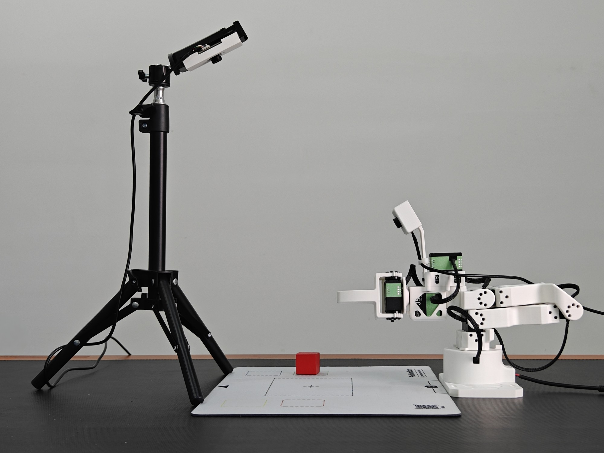
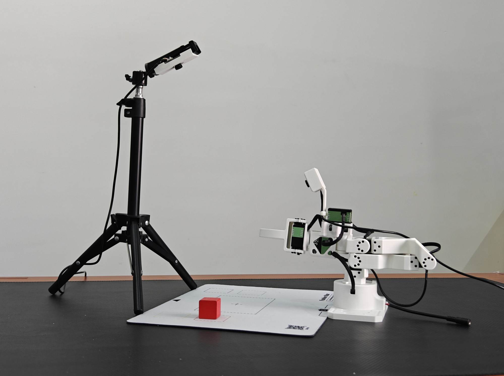
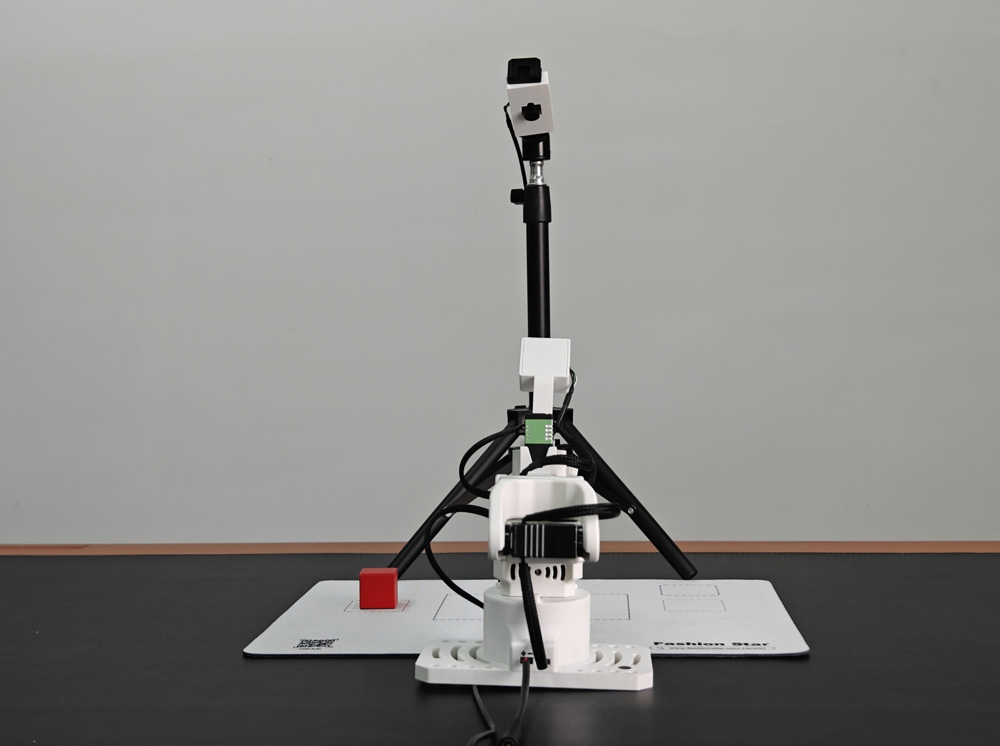

# Star Arm 102 ACT 方块放置模型

这是使用 LeRobot 训练的 Star Arm 102 方块放置策略。模型输入包含机械臂状态，以及两路 640 × 480 相机画面：`up`（上方视角）和 `front`（正面视角）。训练完成于 100,000 步。

下面直接列出客户需要执行的命令。动手前先看[训练场景摆放参考](#训练场景摆放参考)。可下载 [Word 版客户运行指南](docs/Star_Arm_102_ACT_客户运行指南.docx) 留存；完整模型在本仓库的 [v1.0.0 Release](https://github.com/VincentHSS/star-arm-102-act-model/releases/tag/v1.0.0)。

## 下载和放置模型

在 Ubuntu 电脑上执行以下命令，下载并解压模型。压缩包约 191 MB：

```bash
curl -L -o stararm102_pick_act_torch271.tar.gz \
  https://github.com/VincentHSS/star-arm-102-act-model/releases/download/v1.0.0/stararm102_pick_act_torch271.tar.gz
mkdir -p ~/models/stararm102_pick_act_torch271
tar -xzf stararm102_pick_act_torch271.tar.gz -C ~/models/stararm102_pick_act_torch271
ls ~/models/stararm102_pick_act_torch271/pretrained_model
```

模型路径应为：

```text
~/models/stararm102_pick_act_torch271/pretrained_model
```

运行命令中的 `--policy.path` 要指向这个目录。目录内应包含 `config.json`、`model.safetensors`、`train_config.json` 和预处理器文件；请保留整个文件夹。

## 安装运行环境

已经有能运行 Star Arm 102 的 LeRobot 0.4.1 环境时，激活原环境即可。新电脑先安装 [Miniforge](https://github.com/conda-forge/miniforge#install)，重新打开终端，然后在 Ubuntu 22.04 上按下面的顺序安装 Python 3.10、LeRobot 和 Star Arm 102 插件：

```bash
conda create -n stararm102-act python=3.10 -y
conda activate stararm102-act
conda install -c conda-forge ffmpeg -y
python -m pip install "lerobot==0.4.1" \
  "lerobot-robot-stararm102==0.0.1" \
  "lerobot-teleoperator-stararm102==0.0.1"
```

训练机使用 RTX 5070 Ti，已验证的 PyTorch 组合为 `torch 2.7.1`、`torchvision 0.22.1`、`torchaudio 2.7.1` 的 CUDA 12.8 构建。客户也使用 RTX 50 系列 GPU 时，可以在同一个环境中运行：

```bash
python -m pip install torch==2.7.1 torchvision==0.22.1 torchaudio==2.7.1 \
  --index-url https://download.pytorch.org/whl/cu128
python -m pip check
python -c "import torch; print(torch.__version__, torch.cuda.is_available()); print(torch.cuda.get_device_name(0) if torch.cuda.is_available() else 'CPU')"
```

其他显卡请在 [PyTorch 官方安装页面](https://pytorch.org/get-started/locally/) 选择适合的构建。`torch` 应保持在 LeRobot 0.4.1 支持的范围内。安装完成后，运行 `lerobot-record --help` 确认命令可用。

## 检查设备并校准

接好 Star Arm 102 从臂和两台相机，检查实际设备名：

```bash
ls -l /dev/ttyUSB*
lerobot-find-cameras opencv
```

下面示例假设从臂是 `/dev/ttyUSB1`，上方相机是 `/dev/video0`，正面相机是 `/dev/video1`。两台相机的序号可能因电脑或 USB 插口而改变。要确认画面内容，使 `up` 对应上方视角、`front` 对应正面视角；模型输入的这两个名称保持不变。

首次使用从臂时，先按 Star Arm 102 的校准流程完成校准。使用本页示例 ID 的命令为：

```bash
lerobot-calibrate \
  --robot.type=lerobot_robot_stararm102 \
  --robot.port=/dev/ttyUSB1 \
  --robot.id=customer_stararm102_follower
```

校准后在运行模型时继续使用同一个 `--robot.id`。启动策略前，固定底座，清空机械臂工作范围，并准备好硬件急停。桌面、相机位置、光照和方块区域应尽量接近训练示范。

## 训练场景摆放参考

采集示范或运行模型前，请参照以下三张照片摆放相机支架、Star Arm 102 从臂和操作垫。固定相机朝向、机械臂底座与操作垫的相对位置；让 `up` 和 `front` 两路画面都能清楚拍到训练工作区。照片提供的是位置与视角参考，没有标注精确距离，最终以两路实时画面和实际训练示范为准。

侧面总览：相机支架在操作垫左侧，从臂固定在右侧，镜头朝向操作区域。



斜侧视角：检查机械臂、操作垫和红色方块的相对位置；方块放在训练示范覆盖的起始区域。



正面视角：检查相机支架与机械臂的前后关系，并确认方块区域没有被机械臂底座遮挡。



每次采集或评估前，核对两路相机画面没有对调、镜头没有明显偏转，并将方块放在训练数据包含的位置范围内。照片中的方块位置只是摆放示例；不要据此推断单一固定坐标。

## 训练完成后的现场视频

点击下方播放器即可在线观看。请结合上方三张照片核对设备摆位，再进行数据采集或模型验证。

https://github.com/user-attachments/assets/cd992f85-65b6-42db-b179-1a9ba4041f03

[下载原视频（MP4，约 61 MB）](https://github.com/VincentHSS/star-arm-102-act-model/releases/download/v1.0.0/stararm102_act_trained_demo.mp4)

## 单组验证示例

修改命令中的从臂串口和两台相机路径后，先运行 1 组：

```bash
lerobot-record \
  --robot.type=lerobot_robot_stararm102 \
  --robot.port=/dev/ttyUSB1 \
  --robot.id=customer_stararm102_follower \
  --robot.cameras='{up: {type: opencv, index_or_path: /dev/video0, width: 640, height: 480, fps: 30}, front: {type: opencv, index_or_path: /dev/video1, width: 640, height: 480, fps: 30}}' \
  --policy.path="$HOME/models/stararm102_pick_act_torch271/pretrained_model" \
  --display_data=true \
  --dataset.repo_id=customer/eval_stararm102_pick_run1 \
  --dataset.root="$HOME/lerobot_data/eval_stararm102_pick_run1" \
  --dataset.num_episodes=1 \
  --dataset.episode_time_s=30 \
  --dataset.reset_time_s=10 \
  --dataset.single_task="将方块放入中心" \
  --dataset.push_to_hub=false
```

该命令会驱动从臂并保存一次本地评估记录。观察机械臂的动作方向、速度和任务结果；异常时立即急停。

## 连续验证 10 组

确认单组运行正常后，可连接主臂用于组间复位，并运行 10 组。下面命令假设主臂串口是 `/dev/ttyUSB0`；执行前按实际设备修改：

```bash
lerobot-record \
  --robot.type=lerobot_robot_stararm102 \
  --robot.port=/dev/ttyUSB1 \
  --robot.id=customer_stararm102_follower \
  --robot.cameras='{up: {type: opencv, index_or_path: /dev/video0, width: 640, height: 480, fps: 30}, front: {type: opencv, index_or_path: /dev/video1, width: 640, height: 480, fps: 30}}' \
  --teleop.type=lerobot_teleoperator_stararm102 \
  --teleop.port=/dev/ttyUSB0 \
  --teleop.id=customer_stararm102_leader \
  --policy.path="$HOME/models/stararm102_pick_act_torch271/pretrained_model" \
  --display_data=true \
  --dataset.repo_id=customer/eval_stararm102_pick_run10 \
  --dataset.root="$HOME/lerobot_data/eval_stararm102_pick_run10" \
  --dataset.num_episodes=10 \
  --dataset.episode_time_s=30 \
  --dataset.reset_time_s=10 \
  --dataset.single_task="将方块放入中心" \
  --dataset.push_to_hub=false
```

每组结束后有 10 秒复位时间，可在此期间重新放置方块。若不使用主臂，从命令中删除连续三行 `--teleop.*`，并在下一组开始前检查从臂的起始姿态。每次重新运行评估，都给 `--dataset.repo_id` 和 `--dataset.root` 使用新的名称和目录。

## 哪些参数需要改

| 参数 | 客户操作 |
| --- | --- |
| `--robot.port` | 改为从臂实际串口，通常是 `/dev/ttyUSB*`。 |
| `--robot.id` | 与从臂校准时使用的 ID 保持一致。 |
| `--robot.cameras` | 修改两台相机的 `index_or_path`；保留 `up` 和 `front` 名称，以及 640 × 480 分辨率。 |
| `--policy.path` | 指向解压后的 `pretrained_model` 文件夹，不是上一级目录或单个权重文件。 |
| `--dataset.repo_id` | 本次评估记录的名称；每次新运行用新名称。 |
| `--dataset.root` | 本地评估数据保存位置；每次新运行用未存在的新目录。 |
| `--dataset.num_episodes` | 评估组数，先用 `1`，稳定后可改为 `10`。 |
| `--dataset.episode_time_s` | 每组最长运行时间，示例为 30 秒。 |
| `--dataset.reset_time_s` | 两组之间的复位等待时间，示例为 10 秒。 |
| `--teleop.port` | 仅在接主臂做组间复位时添加，改为主臂实际串口。 |

这些参数在运行命令里修改，客户不需要为更换串口或相机路径而编辑模型文件。`--dataset.push_to_hub=false` 表示评估数据只保存在本机。

## 常见问题

- 相机打不开：重新运行 `lerobot-find-cameras opencv`，检查视频画面及设备路径。
- 模型加载失败：检查 `--policy.path` 是否指向包含 `config.json` 和 `model.safetensors` 的 `pretrained_model` 目录。
- 提示没有校准文件：先完成从臂校准，并保持同一个 `--robot.id`。
- 提示数据目录已存在：换一个新的 `--dataset.root` 和 `--dataset.repo_id`。
- 组间出现无 teleop 的提示：如需主臂复位，加入上面的三项 `--teleop.*`；否则手动确认下一组的起始姿态。
- 动作表现不稳定：核对 `up`/`front` 画面是否交换，以及相机位置、物体、光照和起始姿态是否接近训练示范。

模型模仿的是“将方块放入中心”这一项任务。它不会自行判断新物体何时放入，也不会无限次自动重启；运行组数由 `--dataset.num_episodes` 控制。

## 模型信息

| 项目 | 值 |
| --- | --- |
| 策略 | ACT |
| 任务 | 将方块放入中心 |
| 训练步数 | 100,000 |
| 输入 | 7 维机械臂状态；`up` 和 `front` 两路 RGB 画面 |
| 输出 | 7 维动作 |
| 相机规格 | 640 × 480，30 FPS |
| 模型包 | `stararm102_pick_act_torch271.tar.gz`，191,108,326 字节 |

模型适用于训练示范覆盖的任务和工作范围；部署前请完成实机验证。

## 相关资料

- [Star Arm 102 LeRobot 官方教程](https://github.com/servodevelop/Star-Arm-102/blob/main/Lerobot/stararm102.md)
- [PyTorch 官方安装页面](https://pytorch.org/get-started/locally/)
